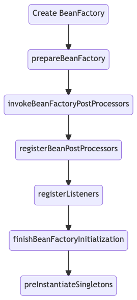

# Dubbo 3 Spring Initialization

## Spring Context Initialization

首先，我们先来看一下Spring context初始化主要流程，如下图所示：




相关代码：org.springframework.context.support.AbstractApplicationContext#refresh()

简单描述一下每个步骤包含的内容：
1. 创建BeanFactory：读取加载XML/注解定义的BeanDefinition。
2. prepareBeanFactory: 注册提前加载的各种内置post-processor以及环境变量等。

3. invokeBeanFactoryPostProcessors: 加载BeanDefinitionRegistryPostProcessor和
BeanFactoryPostProcessor。注意这里的加载顺序比较复杂，还涉及到多次加载，详细请查看代码。
常用于加载较早初始化的组件，如属性配置器PropertyPlaceholderConfigurer和PropertySourcesPlaceholderConfigurer。
还有一个比较重要的ConfigurationClassPostProcessor实现了BeanDefinitionRegistryPostProcessor接口，用于加载@Configuration类，解析@Bean定义并注册BeanDefinition。
这个阶段常用于注册自定义BeanDefinition。

4. registerBeanPostProcessors: 加载并注册各种BeanPostProcessor，常用于修改或包装(代理)bean实例，如Seata的GlobalTransactionScanner。

5. registerListeners: 加载并注册ApplicationListener，处理earlyApplicationEvents

6. finishBeanFactoryInitialization: 注册EmbeddedValueResolver，冻结配置

7. preInstantiateSingletons: 遍历加载单例bean，也就是加载普通的bean，包括@Controller, @Service, DAO等。

## FactoryBean 
Spring容器支持两种bean：普通bean和工厂bean(FactoryBean)。我们经常写的@Controller/@Service这种被Spring直接初始化的bean就是普通bean，
而FactoryBean则是先由Spring先创建FactoryBean实例，然后由其再创建最终的bean实例。

```
[Spring BeanFactory] --create---> [XxxFactoryBean instance] --create--> [Final Bean Instance]
```

FactoryBean接口如下：
```java
public interface FactoryBean<T> {
  /**
   * Return an instance (possibly shared or independent) of the object managed by this factory.
   */
	T getObject() throws Exception;

  /**
   * Return the type of object that this FactoryBean creates, or null if not known in advance.
   * This allows one to check for specific types of beans without instantiating objects, for example on autowiring.
   */
  Class<?> getObjectType();

}
```

## BeanDefinition
Spring bean分为注册和创建实例两大阶段。将从Spring XML/注解解析到的bean信息放到BeanDefinition，然后将其注册到BeanFactory，后面会根据BeanDefinition来初始化bean实例。
不管是普通bean还是工厂bean，都是先注册bean definition，然后按照依赖顺序进行初始化。

两者BeanDefinition的差异是：
* 普遍bean的BeanDefinition的beanClassName为最终bean的class
* 工厂bean的BeanDefinition的beanClassName为工厂bean的class

注册Bean主要有几种方式：
1. 在Spring XML中定义< bean />，由Spring解析生成并BeanDefinition
2. 在Spring java config中声明@Bean方法，由Spring解析生成并BeanDefinition
3. 调用BeanDefinitionRegistry.registerBeanDefinition()方法手工注册BeanDefinition
4. 通过SingletonBeanRegistry.registerSingleton()方法注册bean实例。

注意：注册bean实例与前面三种注册BeanDefinition有本质的区别。
打个比方，注册BeanDefinition是新儿子，Spring会管理bean的初始化及依赖注入及解决属性占位符，调用BeanPostProcessor进行处理等。
而注册bean实例就是别人的儿子，Spring将其视为已经完成初始化的bean，不会解决其依赖和属性占位符。后面会讲到Dubbo 2.7/3两个版本Reference注解注册bean的差异。


## 初始化bean

创建bean大概有下面几个步骤：
* 创建实例 createBeanInstance
* 解决依赖 resolveDependency
* 解决属性占位符 applyPropertyValues

其中多次调用BeanPostProcessor进行处理，如果某些BeanPostProcessor此时还没注册，则可能导致遗漏处理了当前的bean。
后面会讲到dubbo 2.7中提前加载config bean导致的一系列问题。

其中关键逻辑请参考代码：AbstractAutowireCapableBeanFactory#doCreateBean()

### 解决依赖
在Spring注解流行起来之后，通常是使用@Autowire注解来注入依赖的bean。此种注入方式大概的流程如下：
* 查找匹配属性类型的beanName列表
* 根据@Qualifier/@Primary/propertyName等选择合适的bean
关键逻辑请参考代码：DefaultListableBeanFactory#doResolveDependency()。

其中第一步，查找匹配类型的beanName列表时会调用ListableBeanFactory#getBeanNamesForType()来枚举检查所有的beanDefinition。
检查bean type的逻辑请查看 AbstractBeanFactory#isTypeMatch()。
涉及的逻辑比较复杂，这里只简单讲一下重要的分支：
* 如果是普通bean，则检查BeanDefinition的beanClass是否匹配
* 如果是FactoryBean，则通过多种方式来预测bean type

FactoryBean的类型预测主要包括下面几种：
1. 如果有DecoratedDefinition，则覆盖BeanDefinition，检查合并后的beanClass是否匹配
2. 通过FactoryBean.OBJECT_TYPE_ATTRIBUTE属性获取beanType (since 5.2)
3. 实例化这个FactoryBean，调用getObjectType()方法来获取beanType
上面提到的第三种情况可能会出现实例化失败（如解决属性占位符失败）而被多次创建的问题，即每次预测bean type都会尝试实例化，而每次都失败，直到它所依赖的组件都就绪才成功。

Dubbo ReferenceBean本身也是一个FactoryBean，在2.7中经常因为预测bean type导致被自动初始化，后面会详细讲这个问题。

### 解决属性
在Spring中一般是通过 PropertyPlaceholderConfigurer/PropertySourcesPlaceholderConfigurer来解决XML/@Value中的属性占位符${...}。
二者都实现了BeanFactoryPostProcessor接口，会在invokeBeanFactoryPostProcessors阶段被加载，然后遍历处理所有BeanDefinition中的属性占位符。
```
[解析注册BeanDefinition] => [PropertyResourceConfigurer 解决属性占位符] => [加载BeanPostProcessor] => [初始化单例bean]
```

由此可知，如果在PropertyPlaceholderConfigurer/PropertySourcesPlaceholderConfigurer加载前去初始化某个bean，则这个bean的属性占位符是不会被解决的。
这个就是Dubbo config bean 被过早加载导致无法解决占位符的根因。

## Dubbo Spring的一些问题及解决办法

### Dubbo spring 2.7 初始化过程
初始化入口是ReferenceBean#prepareDubboConfigBeans()，即当第一个ReferenceBean初始化完成时，尝试加载其他dubbo config bean。
```java
    @Override
    public void afterPropertiesSet() throws Exception {

        // Initializes Dubbo's Config Beans before @Reference bean autowiring
        prepareDubboConfigBeans();

        // lazy init by default.
        if (init == null) {
        init = false;
        }

        // eager init if necessary.
        if (shouldInit()) {
        getObject();
        }
    }
    
    private void prepareDubboConfigBeans() {
        beansOfTypeIncludingAncestors(applicationContext, ApplicationConfig.class);
        beansOfTypeIncludingAncestors(applicationContext, ModuleConfig.class);
        beansOfTypeIncludingAncestors(applicationContext, RegistryConfig.class);
        beansOfTypeIncludingAncestors(applicationContext, ProtocolConfig.class);
        beansOfTypeIncludingAncestors(applicationContext, MonitorConfig.class);
        beansOfTypeIncludingAncestors(applicationContext, ProviderConfig.class);
        beansOfTypeIncludingAncestors(applicationContext, ConsumerConfig.class);
        beansOfTypeIncludingAncestors(applicationContext, ConfigCenterBean.class);
        beansOfTypeIncludingAncestors(applicationContext, MetadataReportConfig.class);
        beansOfTypeIncludingAncestors(applicationContext, MetricsConfig.class);
        beansOfTypeIncludingAncestors(applicationContext, SslConfig.class);
    }
```

存在的问题： 
1. 没有一个固定的初始化时机，而是与ReferenceBean初始化相关。 如果ReferenceBean被过早初始化，经常出现dubbo配置丢失、属性占位符未解决等错误。
2. 可能在BeanPostProcessor加载完成前初始化ReferenceBean，将导致类似Seata这种通过BeanPostProcessor机制的组件拦截失败。


### Dubbo spring 3的初始化过程
Dubbo 3 中进行大量重构，上面的痛点问题已经被解决，初始化主要流程如下：
```
[Spring解析XML/@Configuration class注册BeanDefinition] => [加载BeanFactoryPostProcessor(包含PropertyResourceConfigurer)] 
 => [1.解析@DubboReference/@DubboService注解并注册BeanDefinition]
 => [加载并注册BeanPostProcessor] 
 => [加载ApplicationListener] => [2.加载DubboConfigBeanInitializer初始化config bean]
 => [初始化单例bean] => [依赖注入ReferenceBean]
 => [3.监听ContextRefreshedEvent事件，启动dubbo框架]
```

主要包含3个阶段：
1. 在BeanFactoryPostProcessor阶段解析@DubboReference/@DubboService注解并注册BeanDefinition。因为此时还是BeanDefinition处理阶段，
故注册的ReferenceBean可以被后续加载的业务bean使用@Autowire依赖注入。同时，也扩展支持在@Configuration bean 方法使用@DubboReference/@DubboService注解。
2. 在加载完所有PropertyResourceConfigurer和BeanPostProcessor之后才会执行DubboConfigBeanInitializer初始化config bean，解决了属性
占位符未解决和BeanPostProcessor拦截失败的问题。
3. 监听在Spring context事件，在其加载完毕时启动dubbo框架。

### 支持在@Configuration bean 方法使用@DubboReference/@DubboService注解
参考Dubbo spring 3的初始化过程的第1阶段。

### 属性占位符解决失败
参考Dubbo spring 3的初始化过程的第2阶段。

### ReferenceBean被过早初始化问题
#### 预测ReferenceBean beanType导致
Dubbo ReferenceBean本身也是一个FactoryBean，在2.7中经常因为预测bean type导致被自动初始化。
例如用户自定义的某个BeanFactoryPostProcessor bean使用了@Autowire注解依赖注入某个业务bean，
而且这个自定义的BeanFactoryPostProcessor bean优先级比解决属性占位符的PropertyResourceConfigurer高，则此时出现解决属性占位符失败。

Dubbo 3中ReferenceBean通过下面两种方式解决预测type的问题:
> FactoryBean的类型预测主要包括下面几种：
> 1. 如果有DecoratedDefinition，则覆盖BeanDefinition，检查合并后的beanClass是否匹配
> 2. 通过FactoryBean.OBJECT_TYPE_ATTRIBUTE属性获取beanType (since 5.2)

#### ReferenceBean被直接依赖导致过早初始
如果在Dubbo config bean初始化前被依赖自动创建ReferenceBean实例，并创建一个Lazy proxy类注入到依赖的类中，不需要解决属性占位符，不会拉起Dubbo框架。
其他的config bean则固定在PropertyResourceConfigurer和BeanPostProcessor加载完成后才会执行初始化，避免了上述问题。

### Reference注解可能出现@Autowire注入失败的问题
在Dubbo 2.7中，在BeanPostProcessor中解析@DubboReference/@Reference注解，创建并注入ReferenceBean实例到Spring容器。这种方式有几个问题：
* @DubboReference/@Reference注解与XML定义的< dubbo:reference />初始化方式不一致，前者是由dubbo初始化，后者是由Spring容器负责初始化。
* 执行时机导致的依赖注入失败问题。按照正常的在invokeBeanFactoryPostProcessors阶段注册完毕所有BeanDefinition，而dubbo 2.7的ReferenceAnnotationBeanPostProcessor
  是在BeanPostProcessor执行时才创建ReferenceBean，可能出现某些比它早初始化的bean使用@Autowire注入失败的情况。

在Dubbo 3中，改成在BeanFactoryPostProcessor解析@DubboReference/@Reference注解并注册ReferenceBean的BeanDefinition，记录字段将要注入的referenceBeanName。
在BeanPostProcessor执行时通过BeanFactory().getBean(referenceBeanName)获取到ReferenceBean实例。
